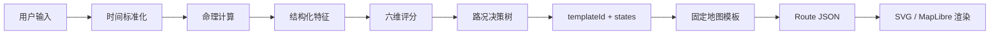

# v1 命理知识接入与生成逻辑说明

日期：2026-05-25

状态：工作版，供 Peter / Andrew / Bill 审核。

## 1. 先说清楚当前状态

当前 `preview/life-roadmap/` 不是命理驱动结果。

当前 preview 是：

```text
手写样例 Route JSON -> SVG 地图渲染 -> 交互验证
```

它验证的是：
- UI 结构。
- 手机端适配。
- A/B/C 路线切换。
- 节点点击。
- 底部导航指令。

它还没有接入：
- 用户真实出生日期。
- 出生地。
- 性别。
- 当前问题。
- `lunar-python`。
- `sxtwl`。
- `cnlunar`。
- Peter 审核后的命理规则卡。

所以当前图上的：
- `23 min`
- `18 min`
- `31 min`
- `隧道末段`
- `风险段`
- `20:00 后小步加速`

都是产品样例，不是命理计算结果。

## 2. 真实版本要用哪些命理知识

v1 会使用命理知识，但只作为「特征输入」和「规则依据」，不直接把术语暴露给用户。

### 2.1 会用

| 命理/时间知识 | 来源 | 用途 |
|---|---|---|
| 公历/农历转换 | `lunar-python` | 处理用户出生日期 |
| 节气 | `lunar-python` + `sxtwl` 校验 | 判断时间阶段，避免立春边界错误 |
| 年/月/日/时干支 | `lunar-python` | 建基础命理特征 |
| 五行映射 | Peter 规则卡 + 干支映射 | 生成长期底色和当日偏向 |
| 生肖 | 年支 | 轻量用户理解与差异化 |
| 当前日干支 | `lunar-python` | 今日信号 |
| 黄历宜忌 | `cnlunar` 交叉校验 | 行动建议参考 |
| 冲煞 | `cnlunar` + Peter 审核 | 风险提示参考 |
| 节假日/工作日 | 节假日 JSON | 调整日常语气和行动建议 |

### 2.2 暂不用

| 内容 | 原因 |
|---|---|
| 紫微斗数 | 首版过重 |
| 周易起卦 | 交互链路不够短 |
| 奇门遁甲 | 规则复杂，Peter 需单独审核 |
| 终身大运细断 | 不适合轻量 Web App 首版 |
| 大师排行榜 | 无可审计方法 |

## 3. 命理知识如何进入产品

不是直接输出「你五行缺 X」。

而是转成产品特征。

```text
命理计算结果
-> 结构化特征
-> 六维评分
-> 路况枚举
-> 固定地图模板
-> 用户可理解结果
```

示例：

```text
今日日干支 + 用户基础盘 + 关注点是事业
-> 推进力偏中高、风险偏中高、稳定性偏低
-> roadState = slow_climb
-> riskState = short_congestion
-> laneChange = not_recommended
-> speedAdvice = accelerate_later
-> templateId = steady_climb
-> A 稳妥路
```

用户看到的是：

```text
当前：缓行爬坡
风险段：别硬冲
隧道末段
20:00 后小步加速
导航指令：走 A 稳妥路
```

用户不看到：

```text
干支推导、五行权重、冲煞字段、黄历字段
```

## 4. 生成逻辑总览



## 5. 输入到命理特征

### 5.1 用户输入

```json
{
  "birthDate": "1996-04-18",
  "birthTime": "08:30",
  "birthplace": "杭州",
  "gender": "female",
  "currentCity": "上海",
  "question": "今天适合推进工作吗？"
}
```

### 5.2 时间标准化

输出：

```json
{
  "calendarType": "solar",
  "timezone": "Asia/Shanghai",
  "birthTimeConfidence": "known",
  "currentDate": "2026-05-25",
  "currentTime": "12:45"
}
```

规则：
- 出生时间未知，降低精度。
- 出生地未知，不做真太阳时校正。
- 节气边界附近，降低置信度。

### 5.3 命理计算输出

示例结构：

```json
{
  "birthChart": {
    "yearPillar": "丙子",
    "monthPillar": "壬辰",
    "dayPillar": "乙未",
    "hourPillar": "庚辰",
    "dayMaster": "乙",
    "zodiac": "鼠",
    "wuxingVector": {
      "wood": 2,
      "fire": 1,
      "earth": 3,
      "metal": 1,
      "water": 1
    }
  },
  "todaySignal": {
    "date": "2026-05-25",
    "dayPillar": "己亥",
    "solarTerm": "小满",
    "huangli": {
      "yi": ["整理", "沟通"],
      "ji": ["冲动决策", "争执"]
    }
  }
}
```

具体干支仅为结构示例，真实值必须由引擎计算。

## 6. 命理特征到六维评分

v1 六维：

| 维度 | 用户语言 | 命理/时间输入 |
|---|---|---|
| `momentum` | 推进力 | 今日干支、节气阶段、黄历宜项、关注点 |
| `stability` | 稳定性 | 五行平衡、日内风险、黄历忌项 |
| `support` | 支持度 | 用户基础盘与今日信号的相容性、贵人/外部支持规则 |
| `relationship` | 关系顺畅 | 关注点、冲煞/沟通类规则、情绪风险 |
| `wealthSafety` | 财富安全 | 黄历忌项、风险分、用户关注点 |
| `risk` | 风险干扰 | 冲煞、黄历忌项、稳定性反向指标 |

评分不是玄学术语直出。

评分是产品中间层。

```json
{
  "scores": {
    "momentum": 72,
    "stability": 48,
    "support": 64,
    "relationship": 42,
    "wealthSafety": 58,
    "risk": 67
  }
}
```

## 7. 六维评分到路况

### 7.1 路况枚举

```json
{
  "roadState": "slow_climb",
  "riskState": "short_congestion",
  "tunnelState": "near_exit",
  "laneChange": "not_recommended",
  "speedAdvice": "accelerate_later",
  "recommendedRoute": "A"
}
```

### 7.2 映射规则

示例：

```text
if risk >= 60:
  riskState = short_congestion

if stability < 55 and support >= 55:
  tunnelState = near_exit

if risk >= 60 or stability < 50:
  laneChange = not_recommended

if momentum >= 60 and risk < 70:
  speedAdvice = accelerate_later

if risk >= 70:
  recommendedRoute = A
else if momentum < 45:
  recommendedRoute = C
else if momentum >= 78 and stability >= 60:
  recommendedRoute = B
else:
  recommendedRoute = A
```

## 8. 路况到地图

决策树不生成坐标。

决策树只输出：

```json
{
  "templateId": "steady_climb",
  "states": {
    "riskState": "short_congestion",
    "tunnelState": "near_exit",
    "laneChange": "not_recommended",
    "speedAdvice": "accelerate_later"
  }
}
```

地图渲染器根据 `templateId` 使用固定模板：

```text
steady_climb
-> 固定 A/B/C 路线骨架
-> 固定风险段槽位
-> 固定隧道槽位
-> 固定出口槽位
-> 固定标签锚点
```

这样视觉稳定。

## 9. Trace 机制

每个结果必须能解释。

示例 trace：

```json
{
  "traceId": "trace_20260525_001",
  "input": {
    "birthDate": "1996-04-18",
    "birthTimeKnown": true,
    "questionIntent": "career_push"
  },
  "calculation": {
    "engine": "lunar-python",
    "solarTermValidator": "sxtwl",
    "huangliValidator": "cnlunar"
  },
  "features": {
    "solarTerm": "小满",
    "wuxingVector": "masked_internal",
    "huangliSignal": "整理/沟通 positive, 冲动决策 negative"
  },
  "scores": {
    "momentum": 72,
    "stability": 48,
    "support": 64,
    "risk": 67
  },
  "rules": [
    {
      "ruleId": "risk_60_add_short_congestion",
      "input": "risk=67",
      "output": "riskState=short_congestion"
    },
    {
      "ruleId": "stability_low_support_mid_add_tunnel",
      "input": "stability=48,support=64",
      "output": "tunnelState=near_exit"
    },
    {
      "ruleId": "risk_or_stability_no_lane_change",
      "input": "risk=67,stability=48",
      "output": "laneChange=not_recommended"
    }
  ],
  "render": {
    "templateId": "steady_climb",
    "selectedRoute": "A"
  }
}
```

## 10. Peter / Andrew / Bill 分工

Peter：
- 审命理特征是否可用。
- 审五行/干支/黄历如何映射到产品维度。
- 审哪些表达不能说。

Andrew：
- 实现历法、节气、干支、黄历计算。
- 验证边界条件。
- 输出结构化 feature。

Bill：
- 定义用户可见语言。
- 定义六维评分。
- 定义路况映射。
- 定义页面与交互。

## 11. 需要 Peter 决策的问题

1. 五行强弱是否可以进入 v1 评分。
2. 黄历宜忌是否能影响行动建议。
3. 冲煞是否能影响风险段。
4. 性别是否在 v1 使用。
5. 出生时间未知时，哪些结论必须禁用。
6. 哪些命理术语可以进入内部 trace。
7. 哪些术语不能出现在用户结果页。

## 12. 当前结论

当前 preview 没有用命理知识。

正式 v1 必须使用命理知识，但使用方式是：

```text
命理知识 -> 结构化特征 -> 产品评分 -> 路况枚举 -> 固定地图模板
```

不是：

```text
命理知识 -> 大模型自由解释 -> 任意地图结果
```

