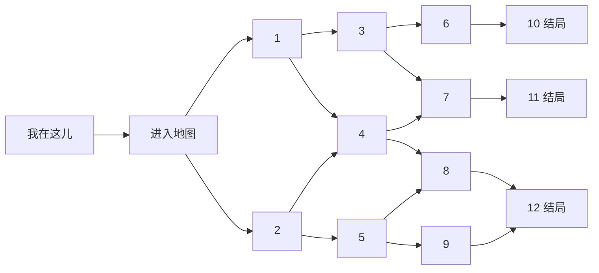

# 人生路况点击交互拓扑 v3 草案

日期：2026-05-30

## 1. 目标

本文只定义点击后的显示逻辑。

它不定义命理内容，不定义 icon，不定义文案质量。

前端先复现这个拓扑，再把生成逻辑接入。

## 2. 两层逻辑

### 2.1 点击逻辑

点击逻辑决定：

- 当前显示哪些地图节点。
- 下方两张卡片分别对应哪个节点。
- 用户点击一个节点后，下一步展示哪些未来节点。
- 哪些节点高亮，哪些节点隐藏或弱化。

点击逻辑必须稳定，不由大模型临时生成。

### 2.2 生成逻辑

生成逻辑决定：

- 每个节点代表什么人生状态。
- 每个节点使用哪个 icon。
- 每个节点的短解读和详解。
- 用户最终走向哪类结果。

生成逻辑可以使用规则层和 LLM，但不能改变点击拓扑。

## 3. 点击拓扑原则

点击逻辑是一张从 `ME / START` 出发的二叉有向无环图。

规则：

- 每个当前点最多出现 2 个下一步选项。
- 所有节点必须从 `START` 可达。
- 路只能向前展开，不回到上游节点。
- 中间节点可以合流。
- 终局固定为 3 个：`10`、`11`、`12`。
- `1-12` 都是地图状态锚点，不再使用虚拟 `OUTCOME_*`。

说明：

```text
这不是严格数学树，因为 4、7、8、12 都有合流。
产品上仍按“每一步最多两种可能”展示。
```

## 4. 地图节点约定

当前地图有：

- `ME`：我在这儿，表示当前用户位置。
- `1-12`：12 个地图状态锚点。

终局节点：

- `10`
- `11`
- `12`

## 5. 默认进入态

用户填完个人信息，点击“分析我未来的路”后：

- 地图显示 `ME`。
- 地图只亮起节点 `1` 和节点 `2`。
- 下方左卡显示节点 `1` 的解读。
- 下方右卡显示节点 `2` 的解读。

含义：

```text
当前用户面临两个未来选项：选 1，或选 2。
```

## 6. 点击路径

| 当前状态 | 左卡 | 右卡 | 说明 |
|---|---|---|---|
| `START` | `1` | `2` | 进入地图后的第一组选择 |
| `1` | `3` | `4` | 选择 1 后展开 |
| `2` | `4` | `5` | 选择 2 后展开 |
| `3` | `6` | `7` | 选择 3 后展开 |
| `4` | `7` | `8` | 选择 4 后展开 |
| `5` | `8` | `9` | 选择 5 后展开 |
| `6` | `10` | 空 | 选择 6 后进入终局 10 |
| `7` | `11` | 空 | 选择 7 后进入终局 11 |
| `8` | `12` | 空 | 选择 8 后进入终局 12 |
| `9` | `12` | 空 | 选择 9 后进入终局 12 |
| `10` | 空 | 空 | 终局 |
| `11` | 空 | 空 | 终局 |
| `12` | 空 | 空 | 终局 |

## 7. 草图



## 8. 前端实现建议

### 8.1 状态字段

```json
{
  "currentNode": "START",
  "path": ["START"],
  "visibleOptions": ["1", "2"],
  "selectedHistory": [],
  "isEnded": false
}
```

### 8.2 转移表

```json
{
  "START": ["1", "2"],
  "1": ["3", "4"],
  "2": ["4", "5"],
  "3": ["6", "7"],
  "4": ["7", "8"],
  "5": ["8", "9"],
  "6": ["10"],
  "7": ["11"],
  "8": ["12"],
  "9": ["12"],
  "10": [],
  "11": [],
  "12": []
}
```

### 8.3 渲染规则

- `visibleOptions` 中的节点亮起。
- `selectedHistory` 中的节点保留淡高亮，表示已经走过。
- 其他节点隐藏或弱化。
- 下方卡片按 `visibleOptions` 顺序渲染。
- 两个选项时显示左右两张卡。
- 一个选项时显示一张主卡。
- 进入 `10 / 11 / 12` 后显示终局总结，不再展开下一组节点。

## 9. 自检结果

| 检查项 | 结果 | 说明 |
|---|---|---|
| 从 `START` 出发 | 通过 | 第一层是 `1 / 2` |
| 节点可达 | 通过 | `1-12` 全部从 `START` 可达 |
| 每点最多 2 个选项 | 通过 | 最大出度为 2 |
| 无回头路径 | 通过 | 所有边向终局方向推进 |
| 无循环 | 通过 | 当前图是 DAG |
| 终局数量 | 通过 | `10 / 11 / 12` 三个终局 |
| 合流 | 通过 | `4 / 7 / 8 / 12` 可由不同路径进入 |

结论：

```text
当前拓扑自洽，可作为 v3 点击逻辑。
```
