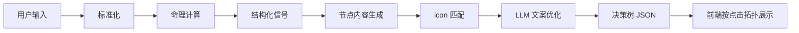

# 人生路况生成逻辑 v3 草案

日期：2026-05-30

## 1. 目标

生成逻辑负责把用户信息转成一棵可展示的人生决策树。

点击拓扑负责“怎么展开”。

生成逻辑负责“每个节点是什么”。

两者必须分离。

## 2. 输入

用户输入：

```json
{
  "gender": "female",
  "birthDate": "1996-04-18",
  "birthTime": "08:30",
  "birthplace": "杭州"
}
```

系统补充：

```json
{
  "currentDate": "2026-05-30",
  "timezone": "Asia/Shanghai",
  "mapTemplate": "life_topology_map_v3",
  "clickTopologyVersion": "v3"
}
```

## 3. 输出

生成逻辑输出一棵决策树。

```json
{
  "treeId": "life_road_20260530_xxx",
  "currentPosition": {
    "id": "ME",
    "label": "我在这儿",
    "avatar": "female_young"
  },
  "nodes": [],
  "transitions": {},
  "initialVisibleOptions": ["1", "2"]
}
```

## 4. 生成流程



## 5. 规则分层

### 5.1 标准化层

处理：

- 性别。
- 年龄段。
- 出生日期。
- 出生时间。
- 出生地。
- 当前日期。
- 时区。

输出：

```json
{
  "gender": "female",
  "age": 30,
  "ageBand": "young",
  "birthTimeConfidence": "known",
  "timezone": "Asia/Shanghai"
}
```

### 5.2 命理计算层

处理：

- 干支。
- 节气。
- 五行气。
- 日主强弱。
- 冲合刑害。
- 今日宜忌。
- 人生阶段。

输出结构化字段，不直接写文案。

```json
{
  "bazi": {
    "yearPillar": "丙子",
    "monthPillar": "壬辰",
    "dayPillar": "乙未",
    "hourPillar": "庚辰",
    "dayMaster": "乙"
  },
  "wuxing": {
    "wood": 2,
    "fire": 1,
    "earth": 3,
    "metal": 1,
    "water": 1
  },
  "currentSignals": {
    "solarTerm": "小满",
    "momentum": 64,
    "stability": 58,
    "support": 61,
    "risk": 46
  }
}
```

### 5.3 节点内容层

系统为每个节点生成一个人生状态。

每个节点至少包含：

```json
{
  "nodeId": "3",
  "anchorId": "3",
  "stage": "near_future",
  "logicLayer": "opportunity",
  "signalType": "small_test",
  "title": "小步试一下",
  "summary": "有窗口，但不要一次押满。",
  "suitable": "先做一次低成本尝试。",
  "avoid": "不要立刻换掉主线。",
  "iconId": "opportunity_window",
  "detail": "这一步更像开门看风，不是直接定终局。"
}
```

## 6. 12 个节点的生成原则

12 个节点不是固定含义。

固定的是地图位置和点击关系。

可变的是：

- 节点标题。
- 节点说明。
- 节点 icon。
- 节点风险级别。
- 节点适合和不宜。

示例：

| 节点 | 固定部分 | 可变部分 |
|---|---|---|
| `1` | 第一屏选项之一 | 可以是机会、关系、事业推进等 |
| `2` | 第一屏选项之一 | 可以是稳定、绕行、休整等 |
| `4` | 合流节点 | 可以承接 1 或 2 的后续解释 |
| `7` | 合流节点 | 可以承接 3 或 4 的后续解释 |
| `8` | 合流节点 | 可以承接 4 或 5 的后续解释 |
| `10 / 11 / 12` | 终局节点 | 分别代表 3 种人生可能 |

## 7. icon 匹配

icon 不由节点号决定。

icon 由 `signalType` 和 `logicLayer` 决定。

示例：

| logicLayer | signalType | iconId |
|---|---|---|
| opportunity | small_test | `opportunity_window` |
| stability | keep_base | `stability_anchor` |
| risk | avoid_conflict | `risk_barrier` |
| support | ask_for_help | `support_lighthouse` |
| wealth | protect_resource | `wealth_safe_chest` |
| timing | wait_signal | `wait_signal` |
| momentum | push_forward | `momentum_boost` |
| relationship | communicate | `relationship_contact` |

## 8. LLM 使用边界

LLM 可以做：

- 把规则层结果改写成更自然的中文。
- 生成短概述和详解。
- 统一语气。

LLM 不能做：

- 改节点编号。
- 改点击拓扑。
- 改地图坐标。
- 新增未定义节点。
- 删除规则层要求展示的节点。
- 直接给“必然、注定、一定”的结论。

## 9. 推荐输出 Schema

```json
{
  "version": "v3",
  "map": {
    "templateId": "life_topology_map_v3",
    "currentMarker": "ME",
    "anchorCount": 12
  },
  "clickTopology": {
    "initialVisibleOptions": ["1", "2"],
    "transitions": {
      "START": ["1", "2"],
      "1": ["3", "4"],
      "2": ["4", "5"],
      "3": ["6", "7"],
      "4": ["7", "8"],
      "5": ["8", "9"],
      "6": ["10"],
      "7": ["11"],
      "8": ["12"],
      "9": ["12"],
      "10": [],
      "11": [],
      "12": []
    }
  },
  "nodes": [
    {
      "nodeId": "1",
      "anchorId": "1",
      "title": "小步试一下",
      "summary": "有窗口，但先看回音。",
      "suitable": "做一次低成本尝试。",
      "avoid": "不要一次押满。",
      "iconId": "opportunity_window",
      "detail": "这里代表一条可以探出去的路。它不是终局，只是提醒你先试一次。"
    }
  ]
}
```

## 10. 生成后的前端显示

前端不直接展示完整 `nodes`。

前端只按点击状态展示：

```text
当前节点 -> transitions[currentNode] -> 下方卡片 + 地图亮点
```

第一屏：

```text
START -> 1 / 2
```

用户点 1：

```text
1 -> 3 / 4
```

用户点 6：

```text
6 -> 10
```

## 11. 需要确认

生成逻辑依赖以下确认：

1. `10 / 11 / 12` 三个终局分别代表哪三类人生可能。
2. 单选项节点是否只显示一张主卡。
3. 合流节点是否允许根据来路生成不同解读。
