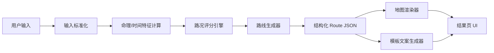

# v1 技术方案：人生路况地图渲染

日期：2026-05-25

状态：工作版，供用户审核。

## 1. 核心判断

不要让大模型直接生成页面。

v1 应该采用：

输入信息 -> 规则/推理引擎 -> 结构化路况 JSON -> 地图渲染器 -> 固定 UI 输出。

大模型最多用于：
- 生成少量解释文案。
- 在固定模板中改写语气。
- 不参与路线、颜色、节点、结论的最终决策。

## 2. 为什么这样做

目标是可控：
- 每次页面风格一致。
- 相同输入得到稳定结果。
- 路线颜色有规则。
- 节点位置有规则。
- 文案不越界。
- 可以 debug。
- 可以 A/B test。

如果让大模型自由生成：
- 风格会漂。
- 节点数量会漂。
- 风险表达会漂。
- 同一个用户多次结果可能不一致。
- 难以解释为什么出现红路、隧道、变道建议。

## 3. 推荐技术路线

### 3.1 v1 推荐：语义地图渲染器

我们不需要真实地图数据。

「人生路况」不是从北京开到机场，而是把人生状态映射成一张类导航图。

因此 v1 推荐做一个「语义地图」：
- 使用固定画布。
- 使用伪地图道路。
- 使用路线 A/B/C。
- 使用节点、拥堵、隧道、出口、岔路。
- 使用开放地图的结构思想，不依赖真实地图瓦片。

实现方式：
- React。
- SVG 优先。
- 必要时 Canvas。
- 数据格式参考 GeoJSON。
- 样式系统参考 MapLibre Style Spec 的 source/layer 思路。

### 3.2 为什么不用真实地图

真实地图会带来问题：
- 需要地图底图授权。
- 需要真实定位权限。
- 用户会以为系统真的在算地理导航。
- 地理信息会增加隐私风险。
- MVP 没有必要。

真实地图只适合后续「城市/方位/地点运势」模块。

### 3.3 可参考的开放地图方案

| 方案 | 适合度 | 用法 |
|---|---:|---|
| 自研 SVG 语义地图 | 最高 | v1 主方案，控制力最强 |
| Mapbox GL JS | 中高 | 真实地图、商业级底图、GeoJSON 叠加；需要 Mapbox token 和商业条款评估 |
| MapLibre GL JS | 中高 | 后续需要真实地图、图层、缩放时使用 |
| Leaflet | 中 | 简单地图交互可用，但视觉精细度一般 |
| OpenLayers | 中 | GIS 能力强，v1 偏重 |
| deck.gl PathLayer | 中 | 后续需要高级路径动效可用 |

当前推荐：

v1 用自研 SVG 语义地图。

v2 如果要真实地图，再在 Mapbox GL JS 和 MapLibre GL JS 中选择。

## 3.4 Mapbox 是否适合

结论：

Mapbox 可以做，但不建议作为 v1 默认方案。

适合 Mapbox 的情况：
- 需要真实城市底图。
- 需要真实当前位置。
- 需要真实路线、POI、地理搜索。
- 需要商业级地图视觉。
- 需要把人生路况叠加在真实城市地图上。

不适合 v1 的原因：
- 需要 Mapbox access token。
- Mapbox GL JS v2+ 受 Mapbox 服务条款约束。
- map load 会进入计费模型。
- 用户可能误解为真实地理导航。
- 我们当前路线 A/B/C 是语义路线，不是真实经纬度路线。
- MVP 的核心是人生状态表达，不是地理路线规划。

如果未来使用 Mapbox，推荐方式是：

```text
Mapbox basemap
-> 自定义 GeoJSON source
-> 自定义 line / symbol layers
-> Route JSON 映射为 GeoJSON
-> 点击 route layer 切换 A/B/C
```

但是 v1 仍应保留同一套数据契约：

```text
用户输入 -> 规则引擎 -> Route JSON -> Renderer
```

Renderer 可以有两个实现：
- `SvgSemanticMapRenderer`
- `MapboxGeoRenderer`

这样产品逻辑不绑定 Mapbox。

## 3.5 Mapbox 与 MapLibre 的选择

| 维度 | Mapbox GL JS | MapLibre GL JS |
|---|---|---|
| 开源属性 | v2+ 不是传统开源授权，需遵守 Mapbox TOS | 开源、社区治理 |
| 底图服务 | Mapbox 官方服务强 | 需接入 MapTiler、OpenFreeMap、自建瓦片等 |
| 商业体验 | 强 | 取决于瓦片服务 |
| 成本控制 | 受 Mapbox pricing 影响 | 更可控，但需要选瓦片服务 |
| v1 适合度 | 中 | 中 |
| v2 真实地图适合度 | 高 | 高 |

推荐：
- v1：自研 SVG。
- v2 商业快速上线：Mapbox。
- v2 开源/成本可控：MapLibre。

## 4. 系统架构



## 5. 输入层

### 5.1 极速模式

最少输入：
- 出生日期。
- 当前关注点。
- 当前城市可选。

输出：
- 基础精度路况。
- 不输出强八字判断。

### 5.2 标准模式

增加：
- 出生时间。
- 出生地。
- 当前城市。
- 性别可选。

输出：
- 更高精度路况。
- 可计算时柱、节气边界、基础八字特征。

## 6. 推理引擎输出

推理引擎不输出自然语言页面。

只输出结构化字段。

### 6.1 内部评分

```json
{
  "scores": {
    "momentum": 72,
    "stability": 48,
    "support": 64,
    "relationship": 42,
    "wealthSafety": 58,
    "risk": 67
  },
  "confidence": "basic",
  "focus": "career"
}
```

### 6.2 状态枚举

所有结论先转成枚举。

```json
{
  "roadState": "slow_climb",
  "riskState": "short_congestion",
  "tunnelState": "near_exit",
  "laneChange": "not_recommended",
  "speedAdvice": "slow_then_accelerate",
  "recommendedRoute": "A"
}
```

枚举必须固定。

前端只认识这些枚举，不解析自由文本。

## 7. 路线生成器

路线生成器负责把评分和枚举转成地图节点。

### 7.1 路线类型

固定三条路线：

| 路线 | 名称 | 含义 |
|---|---|---|
| A | 稳妥路 | 推荐路线，低风险推进 |
| B | 快速路 | 更快但风险高 |
| C | 绕行路 | 慢一些，适合休整 |

### 7.2 路线时间

这里的 `min` 不是实际时间，是类导航表达。

规则：
- A：基准时间。
- B：比 A 短 10%-25%，但风险更高。
- C：比 A 长 20%-40%，但压力更低。

示例：

```json
{
  "routes": [
    {
      "id": "A",
      "name": "稳妥路",
      "durationLabel": "23 min",
      "tag": "推荐",
      "summary": "小步推进",
      "riskLevel": "medium",
      "selected": true
    },
    {
      "id": "B",
      "name": "快速路",
      "durationLabel": "18 min",
      "tag": "风险高",
      "summary": "别硬冲",
      "riskLevel": "high",
      "selected": false
    },
    {
      "id": "C",
      "name": "绕行路",
      "durationLabel": "31 min",
      "tag": "低压",
      "summary": "适合休整",
      "riskLevel": "low",
      "selected": false
    }
  ]
}
```

## 8. 地图数据结构

v1 使用类 GeoJSON 数据。

坐标不是经纬度，而是画布坐标。

范围：
- `x`: 0-100
- `y`: 0-100

### 8.1 Route JSON

```json
{
  "version": "1.0",
  "mapType": "life_navigation_static",
  "title": "今日人生路况",
  "summary": "隧道末段，多云转晴",
  "current": {
    "x": 12,
    "y": 82,
    "label": "你在这里"
  },
  "destination": {
    "x": 86,
    "y": 18,
    "label": "今日目标：状态回升"
  },
  "segments": [
    {
      "id": "a1",
      "routeId": "A",
      "type": "slow",
      "points": [[12, 82], [28, 70], [40, 62]],
      "label": "当前：缓行爬坡",
      "colorToken": "traffic_amber"
    },
    {
      "id": "a2",
      "routeId": "A",
      "type": "risk",
      "points": [[40, 62], [52, 54]],
      "label": "风险段：别硬冲",
      "colorToken": "traffic_red"
    },
    {
      "id": "a3",
      "routeId": "A",
      "type": "tunnel",
      "points": [[52, 54], [66, 42]],
      "label": "隧道末段",
      "colorToken": "traffic_dark"
    },
    {
      "id": "a4",
      "routeId": "A",
      "type": "opportunity",
      "points": [[66, 42], [86, 18]],
      "label": "下一出口：旧项目推进",
      "colorToken": "traffic_green"
    }
  ],
  "branches": [
    {
      "id": "b_branch",
      "routeId": "B",
      "type": "fast_risky",
      "points": [[40, 62], [58, 38], [86, 18]],
      "label": "B 快速路：高风险变道",
      "colorToken": "traffic_red_muted"
    },
    {
      "id": "c_branch",
      "routeId": "C",
      "type": "detour",
      "points": [[28, 70], [30, 88], [72, 78], [86, 18]],
      "label": "C 绕行路：低压休整",
      "colorToken": "traffic_gray_green"
    }
  ],
  "annotations": [
    {
      "x": 32,
      "y": 66,
      "label": "保持车道",
      "icon": "lane"
    },
    {
      "x": 50,
      "y": 55,
      "label": "降速通过",
      "icon": "warning"
    },
    {
      "x": 72,
      "y": 34,
      "label": "20:00 后小步加速",
      "icon": "exit"
    }
  ],
  "instruction": {
    "title": "走 A 稳妥路",
    "body": "保持车道，低速通过风险段，20:00 后小步加速"
  }
}
```

## 9. 渲染层

### 9.1 渲染原则

前端只做渲染，不做命理判断。

前端根据 JSON：
- 画底图。
- 画路线。
- 画节点。
- 画标签。
- 画路线卡。
- 画导航指令。

### 9.2 图层设计

参考开放地图的 source/layer 结构：

| Layer | 内容 |
|---|---|
| `base_blocks` | 浅色城市块背景 |
| `minor_roads` | 灰色细路 |
| `route_inactive` | B/C 非主路线 |
| `route_selected_shadow` | 推荐路线阴影 |
| `route_selected_segments` | A 路线分段 |
| `route_tunnel_overlay` | 隧道遮罩 |
| `markers` | 起点、终点、出口 |
| `annotations` | 保持车道、降速、加速 |
| `route_cards` | A/B/C 选择卡 |
| `instruction_bar` | 底部导航指令 |

### 9.3 颜色 token

不要让模型生成颜色。

固定 token：

| Token | 颜色 | 用途 |
|---|---|---|
| `traffic_blue` | `#2F7DF6` | 主路线 |
| `traffic_green` | `#21A67A` | 机会段 |
| `traffic_amber` | `#F2A93B` | 缓行段 |
| `traffic_red` | `#E5484D` | 风险段 |
| `traffic_dark` | `#31343B` | 隧道段 |
| `traffic_gray` | `#A6ADB8` | 非推荐路 |
| `map_bg` | `#F6F7F4` | 地图底色 |
| `road_minor` | `#D9DED8` | 次级道路 |

## 10. 动效方案

v1 页面可以是静态结果页。

但可以加非常轻的「状态动效」，不改变结论。

### 10.1 静态版

默认方案：
- 一张静态路况图。
- 所有节点一次性展示。
- 标注「静态导航图」。

适合快速上线。

### 10.2 轻动效版

可选增强：
- 路线绘制动画：800ms。
- 当前点轻微 pulse。
- 推荐路线卡从底部上滑。
- 风险段红色微闪一次。
- 出口标记延迟 300ms 出现。

限制：
- 动效只用于展示。
- 不表示实时变化。
- 不改变计算结果。

### 10.3 不建议

首版不做：
- 真实导航移动。
- 实时位置刷新。
- 复杂 3D 地图。
- 大量粒子动效。

## 11. 文案控制

文案不自由生成。

采用模板：

```json
{
  "instructionTemplates": {
    "keep_lane": "保持车道",
    "slow_down": "低速通过风险段",
    "small_acceleration": "{time} 后小步加速",
    "no_lane_change": "暂不建议变道"
  }
}
```

最终文案由枚举拼接：

```text
走 A 稳妥路。保持车道，低速通过风险段，20:00 后小步加速。
```

大模型如需参与，只能改写这句话，不允许改变结论。

## 12. 可控性机制

### 12.1 Schema 校验

每次推理结果必须通过 JSON Schema。

不通过就不渲染。

校验内容：
- 路线必须有 A/B/C。
- 必须有 current。
- 必须有 destination。
- selected route 只能有一条。
- 颜色必须来自 token。
- 文案必须来自模板。
- 风险表达不能出现禁词。

### 12.2 快照测试

固定 20 个测试用户。

每次修改规则后生成路况 JSON 和截图。

检查：
- 页面是否跑版。
- 路线是否缺失。
- 标签是否重叠。
- 风险段颜色是否正确。
- 同一输入是否稳定。

### 12.3 规则 trace

每个结果保留内部 trace：

```json
{
  "trace": [
    {
      "ruleId": "risk_high_today_branch_conflict",
      "input": ["daily_ganzhi", "focus", "huangli_conflict"],
      "output": "riskState=short_congestion"
    }
  ]
}
```

用户不一定看到 trace。

内部必须能查。

## 13. 与命理引擎的关系

命理引擎只负责生成特征和信号。

地图渲染器不懂命理。

分工：

| 模块 | 责任 |
|---|---|
| 命理计算 | 历法、节气、干支、五行、黄历 |
| 评分引擎 | 推进力、稳定性、支持度、风险 |
| 路况映射 | 顺行、缓行、拥堵、隧道、出口、变道 |
| 地图渲染 | SVG/Canvas 画图 |
| 文案模板 | 导航指令和标签 |

## 14. MVP 实现顺序

### Step 1：定义 Route JSON

先不写 UI。

产出：
- `route_schema.json`
- 10 个样例结果。

### Step 2：做静态 SVG renderer

输入一个 Route JSON，输出固定页面。

验证：
- iPhone 13。
- iPhone SE。
- 宽屏 Web。

### Step 3：接入简单规则引擎

先不用完整命理。

用生日、关注点、当前日期生成：
- scores。
- route enum。
- route JSON。

### Step 4：接入真实命理计算

加入：
- `lunar-python` 或 JS 等价库。
- 节气。
- 今日干支。
- 黄历字段。

### Step 5：加入快照测试

用 Playwright 截图回归。

### Step 6：加入轻动效

在静态结果稳定后再加。

## 15. 当前推荐决策

采用「自研 SVG 语义地图」。

原因：
- 最可控。
- 最快。
- 不依赖真实地图授权。
- 最符合人生路况这种抽象产品。
- 可完整模拟导航 App 的路线 A/B/C、拥堵、隧道、出口、变道和加速。

MapLibre / deck.gl 暂不作为 v1 主实现，只作为后续真实地图或高级路径动效的升级方向。

## 16. 官方参考

- MapLibre GL JS：https://maplibre.org/maplibre-gl-js/docs/
- MapLibre Style Spec Sources：https://maplibre.org/maplibre-style-spec/sources/
- MapLibre Style Spec Layers：https://maplibre.org/maplibre-style-spec/layers/
- deck.gl PathLayer：https://deck.gl/docs/api-reference/layers/path-layer
- deck.gl GeoJsonLayer：https://deck.gl/docs/api-reference/layers/geojson-layer
